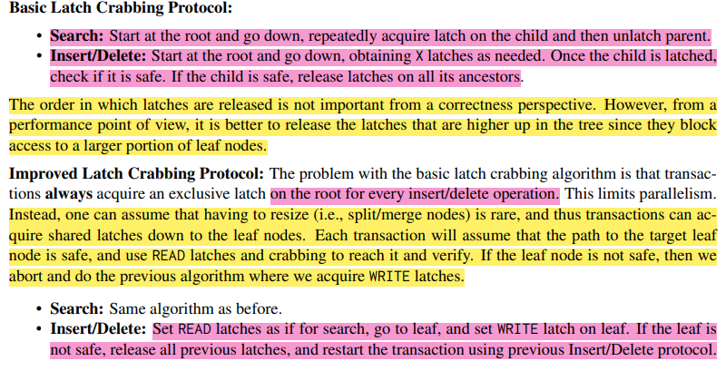

# lab2

## 1. checkpoint1

1. 针对索引，在物理页中其内容是：

   header (page_type: leaf/internal node, LSN, Currentsize (这个节点中的key-value对个数), Maxsize（这个节点最大key-value对个数）, ParentPageId, PageId)

   Body (key-value, key-value, key-value, ...)

   注意：
   - 对于 internal node，其 value 是孩子节点的 page_id；对于叶子节点，则可能是 tuple 或者 recordID
   - 对于 internal node，其第一个 key-value 中，key 是 INVALID。因此搜索时，要从 index 1 开始，而不是 index 0
   - 对于 leaf node，其第一个 key-value 是有效的

2. B+tree 节点：

   root node: children [2, n]，如果是一棵空树，则 root 节点只有一个 pointer (n 等于 Maxsize)

   internal node: children [ceil(n/2), n]

   leaf node: children [ceil((n-1)/2), n-1]

   参考：Database System 7th

   

   

   

   

   

   - B+tree find 查找

   

   - range find 范围查找

   

   - insert 插入

   插入满叶子节点：在插入之前，叶子节点已经有n-1个key-value对，在相应的位置插入一个key-value之后，就达到了满的n个key-value对。这时就需要对节点进行切分，分为前 ceil(n/2)和剩下的key-value，我们记为A和B。然后我们需要将新的这个B加入到B+Tree中：把B最小的那个key，加入到A父节点中，并将它的value设置为B，这样就把B加入到了B+Tree中。当然父节点也可能是满的，因此也会进行切分，依次往上递归处理即可。

   插入满非叶子节点：非叶节点的分裂与叶节点的分裂略有不同，但逻辑是一样的。具体的见 database system 7th 和下面的伪代码。

   1）若为空树，创建一个叶子结点，然后将记录插入其中，此时这个叶子结点也是根结点，插入操作结束。

   2）针对叶子类型结点：根据key值找到叶子结点，向这个叶子结点插入记录。插入后，若当前结点key的个数小于等于m-1，则插入结束。否则将这个叶子结点分裂成左右两个叶子结点，左叶子结点包含前m/2个记录，右结点包含剩下的记录，将第m/2+1个记录的key进位到父结点中（父结点一定是索引类型结点），进位到父结点的key左孩子指针向左结点,右孩子指针向右结点。将当前结点的指针指向父结点，然后执行第3步。

   3）针对索引类型结点：若当前结点key的个数小于等于m-1，则插入结束。否则，将这个索引类型结点分裂成两个索引结点，左索引结点包含前(m-1)/2个key，右结点包含m-(m-1)/2个key，将第m/2个key进位到父结点中，进位到父结点的key左孩子指向左结点, 进位到父结点的key右孩子指向右结点。将当前结点的指针指向父结点，然后重复第3步。

   

   

3. 删除

   [https://www.cnblogs.com/nullzx/p/8729425.html](https://www.cnblogs.com/nullzx/p/8729425.html)

   如果叶子结点中没有相应的key，则删除失败。否则执行下面的步骤

   1）删除叶子结点中对应的key。删除后若结点的key的个数大于等于Math.ceil(m-1)/2 – 1，删除操作结束,否则执行第2步。
  
   2）若兄弟结点key有富余（大于Math.ceil(m-1)/2 – 1），向兄弟结点借一个记录，同时用借到的key替换父结（指当前结点和兄弟结点共同的父结点）点中的key，删除结束。否则执行第3步。
  
   3）若兄弟结点中没有富余的key,则当前结点和兄弟结点合并成一个新的叶子结点，并删除父结点中的key（父结点中的这个key两边的孩子指针就变成了一个指针，正好指向这个新的叶子结点），将当前结点指向父结点（必为索引结点），执行第4步（第4步以后的操作和B树就完全一样了，主要是为了更新索引结点）。
  
   4）若索引结点的key的个数大于等于Math.ceil(m-1)/2 – 1，则删除操作结束。否则执行第5步
  
   5）若兄弟结点有富余，父结点key下移，兄弟结点key上移，删除结束。否则执行第6步
  
   6）当前结点和兄弟结点及父结点下移key合并成一个新的结点。将当前结点指向父结点，重复第4步。

   注意，通过B+树的删除操作后，索引结点中存在的key，不一定在叶子结点中存在对应的记录。

   在实现中，redistribute 和 merge 操作，要考虑左右兄弟，不能只考虑一边。当然，左右兄弟的操作略有不同，但基本思想是一样的。

   > The pseudocode refers to deleting an entry (K, P) from a node. In the case of leaf nodes, the pointer to an entry actually precedes the key value, so the pointer P precedes the key value K. For nonleaf nodes, P follows the key value K.

   

## 2. checkpoint 2

1. 并发下 B+Tree 加锁的基本思想如下：

	（在 C++ Concurrency In Action 书中提到为了避免死锁，我们可以限制加锁的顺序，比如书中提到的层级锁。在这里的体现是从根节点往下依次加锁）：

	- 获取父节点的锁
	- 获取子节点的锁
	- 检查该操作下的子节点是否安全，比如对于 insert 操作，不会导致子节点 split， 对于 delete 操作，不会导致子节点 merge 或者 redistribute。若子节点安全则释放父节点的锁，否则不能释放父节点的锁。

2. B+Tree Basic Latch Crabbing Protocol：

   - Search：从根节点往下，依次获取 child 中的锁，释放 parent 中的锁（读锁）
   - Insert/Delete：从根节点往下，根据需要获得节点的互斥锁（写锁），当 child 被锁住时，检查它是否安全。如果是安全的，释放其所有祖先的锁扣。

3. 优化：

	上述的加锁策略存在的瓶颈是，针对每个 Insert/Delete 操作，都需要先对根节点加互斥锁（写锁），这就限制了程序的并发性。一个改进的地方是，假设当前的 Insert/Delete 操作不会对节点产生不安全的后果，因此，从根节点到叶子节点的父节点，我们只需要加读锁就行，然后对叶子节点加写锁，如果发现该操作确实会导致叶节点不安全，因此释放所有已经获得的锁，撤销该操作，然后再执行最开始的 Basic Latch Crabbing Protocol。这就是乐观锁。

	

4. 对于叶节点遍历的并发：

	可以使用 no-wait 模式，即如果不能获取锁，那么就立即释放已经拥有的锁，然后再重新执行，重新获取锁。该操作可以保证不产生死锁。
	这里不能使用顺序加锁的原则，因为对于 Delete 操作来说（若当前处于不安全的叶节点），它可能会互斥地获取左叶节点/右叶节点，且它是不会自动放弃已经拥有的锁。因此若迭代器此时刚好遍历到它的左叶节点时，若迭代器不释放其已经拥有的锁时，就会发生死锁。

	[https://zhuanlan.zhihu.com/p/593214033?](https://zhuanlan.zhihu.com/p/593214033?)

5. 并发需要注意的一些点：

   - root page id 要使用锁进行保护，无论是读取还是更新，都需要先获得该锁。
   - root page 也需要使用锁进行保护：

      考虑如下场景：

       > 1. 两个线程都获取了根节点的指针。
       > 2. t1先加了写锁，t2阻塞在上写锁。
       > 3. t1 完成插入操作后，解锁。
       > 4. t2获取了写锁，误以为P1还是根节点，插入4，导致树的逻辑结构错误。

       

   - 在删除时，若要对兄弟节点进行 borrow 或者 merge 时，需要对兄弟节点加写锁。
   - 在向上递归操作时，如删除或插入，不要加锁，因为在从上往下访问的过程中给已经加锁了。
   - 可以利用 transaction 中的 PageSet 来记录被加锁的 parent 节点，然后在“子节点安全”时统一释放 parent 节点中的锁和 unpin 操作。此外 transaction 中还有一个 DeletePageSet 可以用来记录 B+Tree 中某些被删除的页，最后再进行统一的删除。
   - 乐观锁实现：对于删除和插入操作，可以先假设子节点都是安全的，一路加读锁，最后在对叶子加写锁。若发现该操作是不安全的，则放弃该操作，释放所有的锁，然后再重新按照悲观锁进行操作。

## 3. 可能需要的知识点

- 柔性数组：

   Reference：[https://www.dazhuanlan.com/qiruo/topics/1272048](https://www.dazhuanlan.com/qiruo/topics/1272048)

   > C99 标准之后引入了柔性数组的概念。在这之前，我们需要在结构体中存放一个动态长度的字符串，一般都是定义一个 char 类型指针，使用该指针指向动态内存空间地址。但是这样操作不太方便， 而且定义的指针也会占用结构体内存啊！

   C99中，结构体中的最后一个成员允许是未知大小的数组，这就叫柔性数组成员。

	```c
	struct S
	{
		int n;
		int arr[];//未知大小的柔性数组成员，数组的大小是可以调整的
	};
	int main()
	{
		struct S s;
		printf("%d\n",sizeof(s));//计算次结构体大小输出 4 并没有计算arr数组的大小
		return 0;
	}
	```

	```c
	// 代码1
	struct S
	{
		int n;
		int arr[];
	};
	int main()
	{
		//创建一个结构体指针ps，给它动态分配4+20个字节的内存
		struct S* ps = (struct S*)malloc(sizeof(struct S) + 5*sizeof(int));
		ps->n = 100;
		int i = 0
		for (i=0;i<5;i++)
		{
			ps->arr[i] = i;//给数组arr赋值 0 1 2 3 4
		}
		free(ps);
		ps = NULL;
		return 0;
	}
	```

	```c
	// 代码2 使用指针
	struct S
	{
		int n;
		int* arr;
	};
	int main()
	{
		struct S* ps = (struct S*)malloc(sizeof(struct S));
		ps->arr = malloc(5*sizeof(int));
		int i = 0
		for (i=0;i<5;i++)
		{
			ps->arr[i] = i;//给数组arr赋值 0 1 2 3 4
		}
		//释放两个开辟的内存
		free(ps->arr);
		ps->arr = NULL;
		free(ps);
		ps = NULL;
		return 0;
	}
	```

- 代码1 和 代码2 都可以实现arr数组大小的灵活调整。但是代码1有两个好处：

   方便内存的释放：如果我们的代码是在一个给别人用的函数中，你在里面做了二次内存分配，并把整个结构体返回给用户，用户调用free可以释放结构体但是用户并不知道这个结构体内的成员也需要free，所以你不能指望用户来发现这个事。所以我们把结构体的内存以及成员要的内存一次性分配好了，并返回给用户一个结构体指针，用户做一次free就可以把所有内存给释放调。
  
   提高访问速度：连续的内存有利于提高访问速度，也有利于减少内存碎片.

- 柔性数组特点
   结构体中的柔性数组成员前面必须有一个其他成员

   sizeof 返回的这种结构大小不包括柔性数组的内容

   包含柔性数组的成员结构用malloc()函数进行内存的动态分配，并且分配的内存应该大于结构体的大小，以适应柔性数组的预期大小。

- 使用指针和使用变长结构体的区别

   在位置方面：指针可以放在任何地方，但是变长结构体的变长部分一定要放在结构体的最后;

   字内存方面：指针会占用一个指针大小的内存空间，但是变长结构体不会，它只是一个占位符;

   在内存布局方面：指针指向的结构体内存可以是不连续的，但是变长结构体和结构体的内存必然是连续的；

   内存释放方面：使用指针时，需要先释放指针所指的内存空间再释放整个结构体，否则会造成内存泄漏；

   一个限制：指针可以使用在 C++ 的类中，但是变长结构体就不可以了。因为某些编译器会将一些额外的 信息放在类的最后，比如 vptr 或者虚基类的内容，使用变长的类时就会把这部分的值改变，这种行为时未定义的， 没有人知道会发生什么！

   注意：柔性数组必须为结构体的最后一个成员！！
