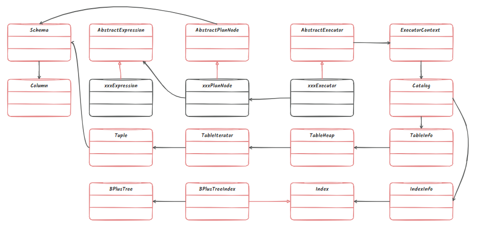
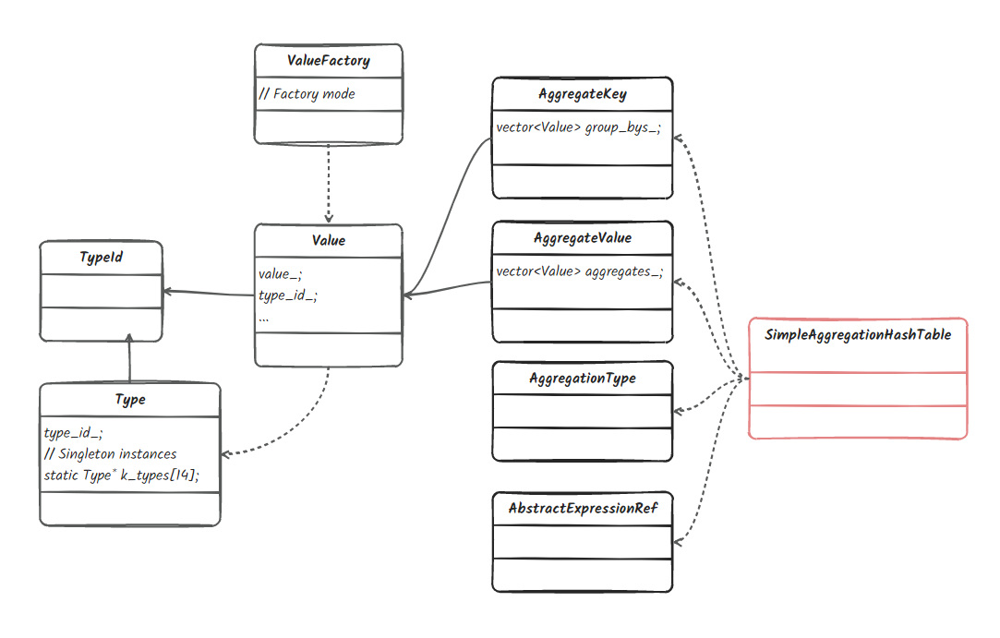
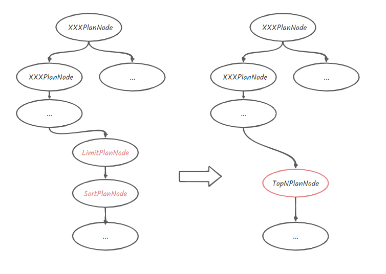

# lab3

## 1. 类图关系



## 2. Task #1 Access Method Executors

1. SeqScan 顺序扫描表
   1. 从 plan 获取表 table_oid，然后再通过 executor -> catalog -> table info 得到这张表，再利用这张表所提供的 table iterator 扫描表的每个 tuple；
   2. 注意 Next 函数每次被调用只返回一个 tuple，因此需要一个 table iterator 成员变量记住当前所遍历到的位置；
   3. 此外，在测试 p3.02-insert.slt 时发现，`insert into t2 select * from t1 where v1 != v1;` 过不了。这是因为漏了 SeqScan 在执行计划 plan 中提供了 filter_predicate_，对于每个 tuple 还需要调用 filter_predicate_->Evaluate 进行过滤：`plan_->filter_predicate_ &&!(plan_->filter_predicate_->Evaluate(tuple, table_info_->schema_).GetAs<bool>())`；
   4. 在 lab3 实验说明中没有提到加锁，因此这里暂不考虑。
2. Insert 插入
   1. Insert 与 SeqScan 的区别是，在表中成功插入 tuple 后，也要在所有的 index 中插入该 tuple；
   2. 获取到 table info 后，再通过 executor -> catalog -> indexes 得到这张表的所有索引；
   3. Insert 的 Next 函数应该只被调用一次，第二次再调用 Next 时，应该返回 false，表示所有 child executor 提交的 tuple 已经插入完毕。所以应该一直调用 child 的 Next 函数，直到其返回 false。
3. Delete 删除
   1. 基本与 Insert 差不多，在表中成功删除 tuple 后，也要在所有的 index 中删除该 tuple；
   2. 实验说明中，在表中删除一个 tuple 使用的是 TableHeap::MarkDelete()。
4. IndexScan 索引扫描
   1. 此处的索引就是 lab2 中所写的 B+Tree，可以通过类型转换将索引 index 转为 B+Tree 索引类型：`tree_ = dynamic_cast<BPlusTreeIndexForOneIntegerColumn *>(index_info_->index_.get())`。然后再通过 lab2 中写的索引迭代器进行扫描；
   2. 通过索引，获得 RID，再根据此 RID 通过 table 得到 tuple。

## 2. Task #2 Aggregation & Join Executors



1. Aggregation
   1. AggregateKey：就是聚集所使用的键，举个例子：`SELECT colA, MIN(colB) FROM __mock_table_1 GROUP BY colA HAVING MAX(colB) > 10;`这里使用的 AggregateKey 就是 colA，也就是说 colA 相同的 tuple 会被放入到同一个 bucket 中进行统计。由于 AggregateKey 可能不止一个，也可能是多个，因此这里使用了 `vector<Value>` 来表示 AggregateKey。注意在此数据库中，所有的数据项都是 Value 类型的。AggregateValue：表示聚集后的值的集合。比如上面 MIN(colB) 就是统计同一个 bucket 中的所有 tuple 中的 colB 最小的值，也就是说它会将一组 tuple 压缩成一个标量。由于我们在做聚集的时候，有时候可能会有多个聚集值，比如同时统计 MIN(colB) 和 MAX(colB)，因此此 AggregateValue 也是一个 `vector<Value>` 类型。
   2. 该 Aggregation 需要用到 hash aggregation，并且假设整个 hash table 都能够放入 memory 中，aggregation 的结果也能完全放入 memory；
   3. SimpleAggregationHashTable 类中给我们提供了一个 `std::unordered_map<AggregateKey, AggregateValue> ht_{};` 哈希表，我们可以利用该哈希表保存 AggregateKey 到 AggregateValue 的映射关系，以此来实现聚集；
   4. 首先，我们需要将从孩子执行器得到的 tuple 转为 AggregateKey 和 AggregateValue。然后，若 AggregateKey 在哈希表中不存在，则需要在哈希表中创建一个初始的 AggregateValue，然后再根据 AggregationType 相应地更新哈希表中此 AggregateKey 对应的 AggregateValue；
   5. 注意，实验说明中指出，若 aggregate 的是一个空表，那么我们要在哈希表中插入一个空白项，其 AggregateValue 应该是：除了 CountStarAggregate 是 0 外，其余聚集类型均是 integer_null；
   6. 该 Aggregate 可能比较绕，在做之前一定要理清各种类之间的关系，以及所使用的工厂模式、单例模式。
2. NestedLoopJoin
   1. 实现一个 simple nested loop join。参考 lecture 11；
   2. 一个注意的点是可以在 Init() 函数中先获取到内层循环（right executor）的所有 tuple，保存起来，这样在 Next 函数中就只用调用 left executor 的 Next 函数获取外层 tuple 即可（注意该外层 tuple 也是需要保存起来了，因为该 Next 一次只返回一个 tuple，下次调用 Next 可能还会用到该 tuple）。这样就不用每次调用 Next 函数是都需要重新获取内层循环的 tuple；
   3. 此外，由于是实现的 left join，因此，即使外层 tuple 没有匹配到内层 tuple 时，也要返回此时外层的 tuple。
3. NestedIndexJoin
   1. 实现一个 nested index join。参考 lecture 11；
   2. 注意实验中内表的相关属性是有索引的，因此在遍历外表 tuple 时可以利用内表的索引来查找匹配项。由于内表索引中存储的是 RID，因此找打匹配项后，还需要从根据 RID 在内表中去找真正的 tuple；
   3. 所需要的相关数据可以在 plan、executor、executor_context 中找到；
   4. 注意实现的也是 left join。

## 3. Task #3 Sort + Limit Executors and Top-N Optimization

1. Sort
   1. 在 task#1 中我们实现了 IndexScanExecutor，那么在没有索引存在的情况下，我们就需要自己对 tuple 进行排序。因此这个任务就是从 child_executor 中获取所有的 tuple 后，对 tuple 进行排序，然后在以原样格式输出，即从 child_executor 得到的 tuple 是什么 schema，就输出什么 schema。注意该 Sort 的 Next 函数是一次输出一个 tuple，因此需要保存排序好的 tuples 和当前输出 tuple 的位置；
   2. 这里做了一些假设：排序的键只出现一次；所有的 tuple 都能够在内存中存下；
   3. 注意在比较时，可能会有多个比较的键值，比如`SELECT * FROM __mock_table_1 ORDER BY colA ASC, colB DESC;`，这时若两个 tuple colA 相等，则比较下一个 ColB。
2. Limit
   1. 限制输出数量；
   2. 在类中记录一个 count，表示已经输出了多少个 tuple 即可。
3. Top-N Optimization Rule
   1. 对于这类查询：`EXPLAIN SELECT * FROM __mock_table_1 ORDER BY colA LIMIT 10;`默认情况下会排序整个表，然后取出前10 个 tuple。一种更有效的方法是我们不排序整个表，而是只关注最小的 10 个 tuple 就行。也就是说我们维护一个容器，里面装的是当前最小的 10 个 tuple，当从 child executor 得到一个新的 tuple 时，我们就尝试更新这容器里面的 10 个 tuple，使其始终保存的是 10 个最小的 tuple；
   2. 首先我们应该实现这个函数 `auto Optimizer::OptimizeSortLimitAsTopN(const AbstractPlanNodeRef &plan) -> AbstractPlanNodeRef`。注意 AbstractPlanNode 表示 plan 树的抽象节点类型（plan 是一棵树形结构，其中节点是 AbstractPlanNode，且每个节点可能包含多个子节点），每个具体的 plan 树节点都继承于它，比如 LimitPlanNode 和 SortPlanNode 等。现在我们给定这棵树的根节点，我们要找出其中符合 LimitPlanNode + SortPlanNode 的结构，把它换成 TopNPlanNode。其实就是 dfs 遍历。
   3. 可以采用优先队列来寻找最小的 10 个 tuple。

      

      ```c
      CREATE TABLE t1(v1 int, v2 int);
      CREATE TABLE t2(v3 int, v4 int);
      CREATE INDEX t2v3 on t2(v3);
      EXPLAIN SELECT * FROM t1 INNER JOIN t2 ON v1 = v3;
      === PLANNER ===
      Projection { exprs=[#0.0, #0.1, #0.2, #0.3] } | (t1.v1:INTEGER, t1.v2:INTEGER, t2.v3:INTEGER, t2.v4:INTEGER)
      NestedLoopJoin { predicate=#0.0=#1.0 } | (t1.v1:INTEGER, t1.v2:INTEGER, t2.v3:INTEGER, t2.v4:INTEGER)
         SeqScan { table=t1 } | (t1.v1:INTEGER, t1.v2:INTEGER)
         SeqScan { table=t2 } | (t2.v3:INTEGER, t2.v4:INTEGER)
      === OPTIMIZER ===
      NestedIndexJoin { key_predicate=#0.0, index=t2v3, index_table=t2 }
      SeqScan { table=t1 }
      ```

## 4. 总结

lab3 整体来说还是比较简单，就是实现各种算子 operator。在实验前一定要注意仔细阅读源码，特别是个类之间的关系，理清数据是从哪里来，怎么处理，提交到哪里去。
